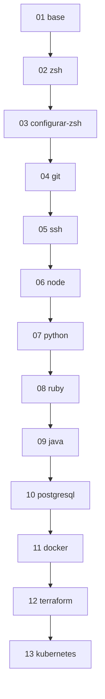

# Arquitectura

> Cómo está organizado **dev-setup-mac-es**.
> **Última actualización**: 2026-07-03

## Panorama general

Este proyecto **no es una aplicación**: es una colección de scripts de shell
independientes que configuran, paso a paso, un entorno de desarrollo completo
sobre macOS. No hay proceso en ejecución, base de datos ni API; el "artefacto" es
un sistema operativo configurado.

## Principios de diseño

- **Un script por herramienta.** Cada tecnología se instala con su propio script,
  ejecutable de forma independiente.
- **Orden explícito por numeración.** El prefijo `NN-` indica el orden recomendado
  de ejecución, pero no obliga: puedes correr solo los que necesites.
- **Idempotencia donde es posible.** Los scripts comprueban si algo ya está
  instalado antes de reinstalarlo.
- **Gestores de versión sobre paquetes del sistema.** Para lenguajes se usan
  `rbenv`, `nodenv`, `pyenv` y SDKMAN! en lugar de una fórmula global de Homebrew,
  para poder fijar y cambiar versiones por proyecto.
- **Homebrew como base.** El script `01` instala Homebrew; el resto lo asume
  presente.
- **Transparencia.** Cada script muestra su progreso y no oculta lo que ejecuta
  con `sudo`.

## Flujo de ejecución recomendado



El orden sigue la saga de entornos de desarrollo del blog: shell y control de
versiones primero, luego lenguajes, y finalmente base de datos, contenedores e
infraestructura.

## Estructura de carpetas

```text
.
├── scripts/            # Un script por herramienta (NN-instalar-*.sh)
├── docs/               # Esta documentación
└── .github/            # Plantillas, automatizaciones y CI
```

## Inventario de scripts

Ver la tabla completa en el [README](../../README.md#scripts-disponibles) y el
detalle de tecnologías en [`stack.md`](stack.md).
