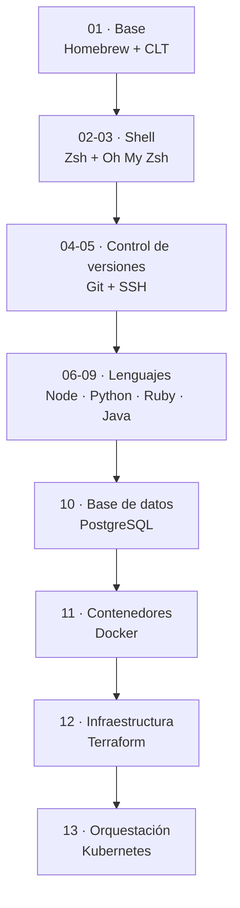

# dev-setup-mac-es — Arquitectura

> Vista de alto nivel de cómo está organizado el repositorio y cómo se reparten
> las responsabilidades entre los scripts. Para el detalle de qué instala cada
> uno, ver [`stack.md`](stack.md).
>
> **Última actualización**: 2026-07-03

## Idea general

El proyecto es una **colección de scripts de shell independientes**, uno por
herramienta. No hay un orquestador central ni estado compartido: cada script se
ejecuta por sí solo y deja el sistema listo para el siguiente. La numeración del
nombre (`NN-…`) codifica el **orden recomendado** de instalación.

## Capas

| Capa                    | Scripts                                  | Responsabilidad                                        |
| ----------------------- | ---------------------------------------- | ------------------------------------------------------ |
| Base                    | `01`                                     | Homebrew, Xcode CLT y librerías esenciales del sistema |
| Shell                   | `02`, `03`                               | Zsh como shell por defecto + Oh My Zsh y plugins       |
| Control de versiones    | `04`, `05`                               | Git configurado y claves SSH para GitHub               |
| Lenguajes               | `06`, `07`, `08`, `09`                   | Node, Python, Ruby y Java con gestores por versión     |
| Base de datos           | `10`                                     | PostgreSQL vía Postgres.app                             |
| Contenedores            | `11`                                     | Docker Desktop (incluye Compose)                       |
| Infraestructura         | `12`, `13`                               | Terraform y Kubernetes (kubectl + minikube)            |

## Principios de diseño

- **Independencia**: cada script funciona solo; la única dependencia dura es que
  Homebrew (del script `01`) esté instalado.
- **Idempotencia**: los scripts verifican antes de instalar y no rompen si la
  herramienta ya existe.
- **Gestores por versión**: los lenguajes se instalan con `nodenv`, `pyenv`,
  `rbenv` y `SDKMAN!` para poder cambiar de versión sin reinstalar.
- **Transparencia**: el script informa cada paso y deja claras las acciones
  manuales pendientes (reiniciar la terminal, inicializar una app, pegar una
  clave en GitHub).
- **Espejo con Linux**: la numeración y el conjunto de herramientas replican el
  repo hermano [`dev-setup-ubuntu-es`](https://github.com/brayandiazc/dev-setup-ubuntu-es).

## Decisiones clave

| Decisión                                           | Dónde se documenta                                                          |
| -------------------------------------------------- | -------------------------------------------------------------------------- |
| Gestores por versión para lenguajes                | [ADR 0002](../decisions/0002-gestores-de-version-por-lenguaje.md)          |
| Apps de escritorio para PostgreSQL y Docker        | [ADR 0003](../decisions/0003-apps-de-escritorio-para-postgres-y-docker.md) |

> El detalle y las alternativas de cada decisión se registran como ADRs en
> [`../decisions/`](../decisions/README.md).

## Referencias

- [`stack.md`](stack.md) — qué instala cada script y con qué método.
- [`../conventions/shell-scripts.md`](../conventions/shell-scripts.md) — cómo se escriben los scripts.
